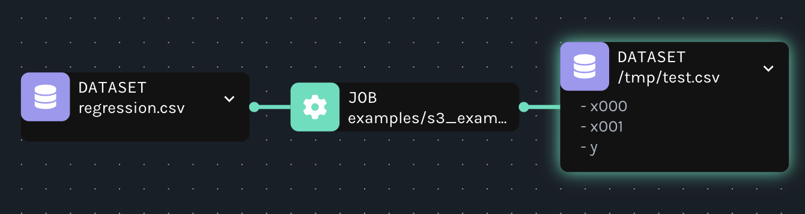

# Pandas OpenLineage Integration

This project demonstrates how the Pandas library can integrate with the OpenLineage framework to track data lineage.

## Approach

The integration involves wrapping common Pandas operations with OpenLineage tracking. This allows capturing metadata about data transformations and movements, which can be used for auditing, debugging, and understanding data workflows.

### Monkey patch
The `pandas` library is monkey patched so that its read and write methods are decorated with OpenLineage wrappers.
This is an example approach that ideally should be integrated into the `pandas` codebase.

### Listener

A singleton `OpenLineageListener` instance is used to collect input and output datasets and to emit a `COMPLETE` event when the program exits. This is achieved by registering the listener with the `atexit` module, ensuring that the event is emitted regardless of how the program terminates. This listener captures the final state of the data lineage, providing a comprehensive view of the data transformations and movements that occurred during the program's execution.

### Job naming
The job name can be either retrieved from the `OPENLINEAGE_JOB_NAME` environment variable or derived from the script path from which it was invoked. Using the environment variable is encouraged because it is difficult to ensure a unique but readable job name otherwise.

## Running Examples

To run the examples, follow these steps:

1. **Clone the repository:**
```bash
git clone https://github.com/JDarDagran/pandas-openlineage.git
cd pandas-openlineage
```

2. **Install dependencies:**
```bash
pip install -e .
```

3. **Run the example script:**
```bash
python examples/s3_example.py
```

This will execute the example script and demonstrate how Pandas operations are tracked using OpenLineage. Events are saved into `examples/s3_events.json`.

### Expected events
The example events produced are also attached in `examples/expected_events.json`.
Additionally, when sent to Marquez, it should be visible as shown below:


## License

This project is licensed under the MIT License.